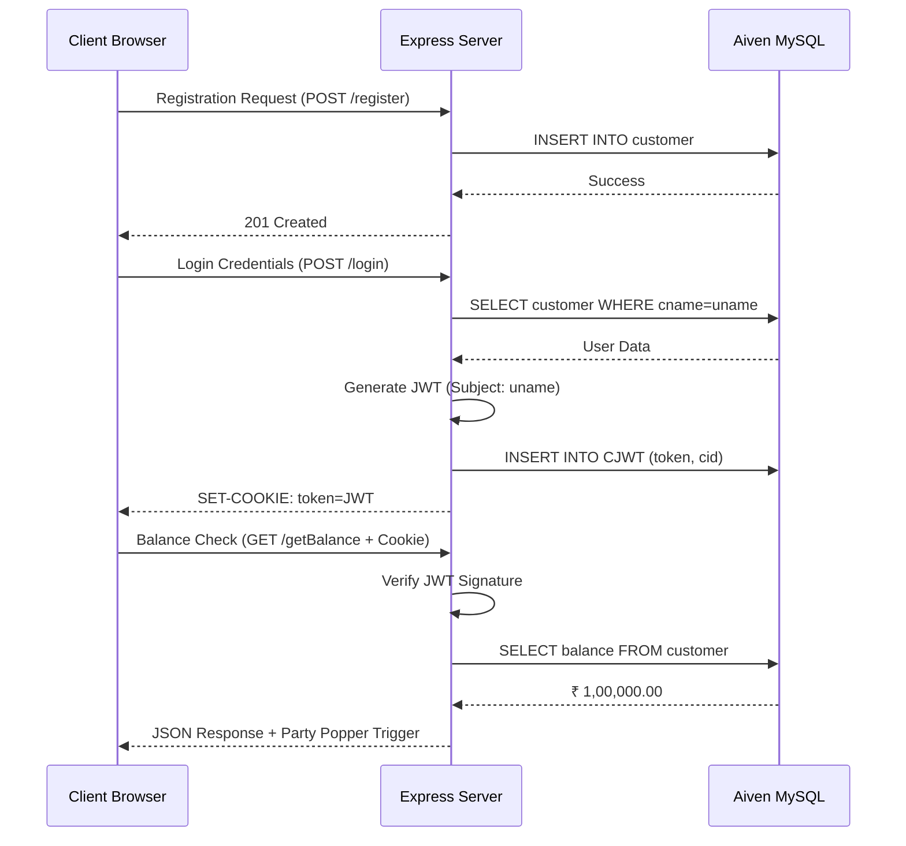

# Kodbank - Premium Stateless Banking Platform

Kodbank is a sophisticated, modern banking application built with a focus on security, performance, and a **Stateless Protocol** architecture. It leverages Node.js, Express, and Aiven MySQL to provide a seamless financial management experience.

---

## 📂 Project Structure

```text
Kodbank/
├── backend/                # Server-side logic
│   ├── auth.js             # JWT generation & verification
│   ├── db.js               # Aiven MySQL connection & queries
│   ├── server.js           # Express app & API routes
│   ├── .env                # Secret credentials (ignored by git)
│   └── package.json        # Node dependencies
├── public/                 # Client-side interface (Vercel standard)
│   ├── css/
│   │   └── style.css       # KodNest premium styles
│   ├── js/
│   │   └── app.js          # DOM logic & API calls
│   ├── dashboard.html      # Main banking interface
│   ├── login.html          # Authentication page
│   └── register.html       # Onboarding page
├── .gitignore              # Protection for secrets
└── README.md               # Documentation
```

---

## 🏗 Architecture: Stateless Protocol

Kodbank follows a strictly stateless architecture as per the "Stateless Protocol" design:

### Logic Flow Diagram


1. **JWT Authentication**: Sessions are managed via JSON Web Tokens stored in **HTTP-only cookies**.
2. **Server Independence**: The server does not store session state in memory, allowing for easy horizontal scaling.
3. **Database Transparency**: User records and active tokens are persisted in Aiven MySQL, ensuring data integrity across instances.

### Database Schema (Aiven MySQL)
- **`customer`**: `cid` (Auto-inc), `cname` (Unique), `cpassword`, `email`, `phone`, `balance` (Default: 1,00,000.00).
- **`CJWT`**: `tid` (Auto-inc), `token` (Text), `cid` (FK), `exp` (Expiry datetime).

---

## ✨ Features

- **Modern Dashboard**: A professional banking command center with sidebar navigation and activity tracking.
- **Spending Analytics**: Stat cards showing total balance, monthly spending (with trends), and investment profits.
- **Secure Balance Check**: Interactive balance reveal with **Party Popper** animation.
- **Stateless Auth**: Robust Login and Registration flow with JWT security.
- **Transaction History**: Detailed view of recent banking activities with status badges.
- **Premium UI**: Built with the **KodNest Design System**, featuring serif headings, minimalist whitespace, and deep red accents.

---

## 🛠 Tech Stack

- **Backend**: Node.js, Express.js
- **Auth**: JsonWebToken (JWT), Cookie-Parser
- **Database**: Aiven MySQL (Cloud)
- **Frontend**: Responsive HTML5, Vanilla CSS3 (KodNest Theme), ES6+ JavaScript
- **Version Control**: Git & GitHub

---

## 🚀 Getting Started

### Prerequisites
- Node.js (v18+)
- Aiven MySQL Service Account

### Installation

1. **Clone the repository**:
   ```bash
   git clone https://github.com/arvindjangir9772/kodbank.git
   cd kodbank
   ```

2. **Install Backend Dependencies**:
   ```bash
   cd backend
   npm install
   ```

3. **Configure Environment Variables**:
   Create a `.env` file in the `backend` directory:
   ```env
   PORT=5050
   JWT_SECRET=your_secret_key
   DB_HOST=your-aiven-host
   DB_USER=avnadmin
   DB_PASSWORD=your-password
   DB_NAME=defaultdb
   DB_PORT=xxxxx
   ```

4. **Run the Application**:
   ```bash
   node server.js
   ```

5. **Access the App**:
   Navigate to `http://localhost:5050` in your web browser.

---

## 📡 API Endpoints

- `POST /register`: Create a new customer account.
- `POST /login`: Authenticate and receive a secure JWT cookie.
- `POST /getBalance`: Fetch current account balance (Protected).
- `GET *`: Serves the Single Page Application shell.

---

## 🎨 Design Philosophy
Kodbank adheres to the **KodNest Premium Build System**—emphasizing calm, intentionality, and confidence. No flashy colors or playful elements; just pure, professional banking.

Developed by **Arvind Jangir** for the **KodNest Premium Suite**.
